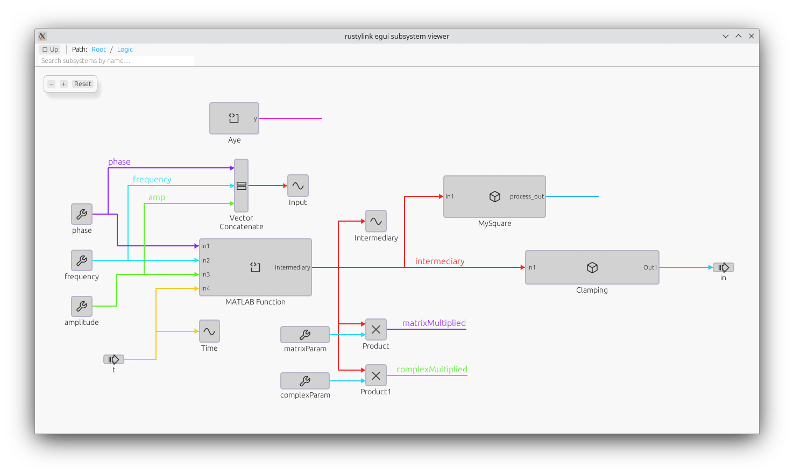

# rustlylink


This crate parses Simulink `slx` files into a JSON representation and optionally provides code to display or analyze the model.

**Important note:** At the moment, we only support the R2025a+ file format. At the moment, there are no plans to support older formats, but contributions are welcome.



This viewer is intended to be a starting point for building your own tools around Simulink models. While it does not intend to be a complete Simulink viewer (many features are unsupported), it is still useful for automation tasks.

**You don't need a MATLAB or Simulink license or installation to use this tool.**

## Quick start

- Build:

```sh
cargo build
```

- Run against your workspace root system:

```sh
cargo run --features egui,highlight --example egui_viewer -- MyModel.slx
```

## Non-GUI examples

Print an ASCII tree of SubSystems in a model (works with `.slx` or individual XML):

```sh
cargo run --example tree -- ASXTest.slx
```

Or point to an XML system file:

```sh
cargo run --example tree -- simulink/systems/system_root.xml
```

## Library usage

```rust
use rustylink::parser::SimulinkParser;
use camino::Utf8PathBuf;

let parser = SimulinkParser::new(".");
let system = parser.parse_system_file(Utf8PathBuf::from("simulink/systems/system_root.xml"))?;
println!("{}", serde_json::to_string_pretty(&system)?);
```

## Notes

- The data model is intentionally generic (maps for properties) to accommodate varying Simulink versions.
- Extend `model.rs` to add more explicit types for blocks you care about.
